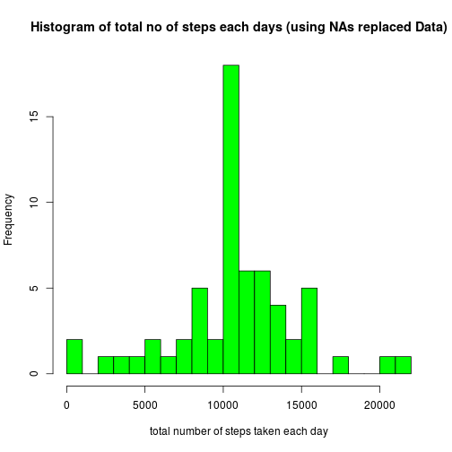

# Reproducible Research: Peer Assessment 1
	Author: UltraMagnus
# 1. Loading and preprocessing the data

### 1. loading the data


```r
data <- read.table("activity.csv", header = TRUE, sep = ",",
			 colClasses = c("numeric", "Date", "integer"))
```

### 2. ignore the missing values in the dataset


```r
cleandata <- data[is.na(data$steps) == FALSE,]
library(dplyr)
library(knitr)
```


# 2. What is mean total number of steps taken per day?

### 1. Calculate the total number of steps taken per day

stepsdaydata contain the total number of steps taken each day


```r
daygroupdata<-group_by(cleandata, date)
stepsdaydata<-summarise(daygroupdata, total = sum(steps))
```
### 2. histogram of the total number of steps taken each day

```r
hist(stepsdaydata$total, breaks = 25, xlab = "total number of steps taken each day",
	main = "Histogram of total no of steps each days (using NAs removed Data)", col = "green")
```

 

### 3. mean and median of the total number of steps taken per day

```r
medianday<-median(stepsdaydata$total)
meanday<-mean(stepsdaydata$total)
kable(matrix(c(meanday, medianday), nrow =2, ncol = 1,
	 dimnames = list(c("mean", "median"), c("with NAs Removed data"))))
```


|       | with NAs Removed data|
|:------|---------------------:|
|mean   |              10766.19|
|median |              10765.00|

# 3. What is the average daily activity pattern?
intervalStepData contains the average of 5 minutes interval avergaed acrossed all days

```r
intervalGroupData<-group_by(cleandata, interval)
intervalStepdata<-summarise(intervalGroupData, avg = mean(steps))
```

### 1. time series plot of the average number of steps taken, averaged across all days (y-axis) vs the 5-minute interval (x-axis)


```r
plot(intervalStepdata$interval, intervalStepdata$avg, type = "l",
		col = "red", xlab = "5 minute interval", ylab = "average number of steps in interval",
		main = "average steps in interval vs time interval")
```

 

### 2. Which 5-minute interval, on average across all the days in the dataset, contains the maximum number of steps

```r
maxavg<-max(intervalStepdata$avg)
maxInterval <- intervalStepdata[intervalStepdata$avg==maxavg,]
```

maxInterval contains the interval which have maximum average steps across all the days
= 835

It correspond to time interval 8:35-8:40 AM

# 4. Imputing missing values

### 1. total number of missing values
number of missing values = total no of rows in original data - total no of rows in cleandata(which contains No NA values)

```r
numrow <-nrow(data)
nrowclean <- nrow(cleandata)
nmissing <- numrow - nrowclean
```

number of missing values = 2304  

### 2. strategy for filling in all of the missing values in the dataset  
replacing the NA in steps in the 5 minute interval to average of steps in that 5 minute interval across all days.  
intervalStepData contains the no of steps in the interval averaged accross all days, there are 288 such 5 minute intervals in a day
in the folloing loop NA values are replaced with corresponding values from intervalStepData

### 3. Create a new dataset that is equal to the original dataset but with the missing data filled in


```r
j<-1
#making copy of original data
imputedData <- data
for( i in c(1:numrow))
{
        if(is.na(imputedData[i,1]) == TRUE)
                imputedData[i, 1] = intervalStepdata$avg[j]
        j = (j+1)
        if(j == 289)
                j = 1
}
```

### 4. histogram of the total number of steps taken each day


```r
daygroupdata<-group_by(imputedData, date)
stepsdaydata<-summarise(daygroupdata, total = sum(steps))
hist(stepsdaydata$total, breaks = 25, xlab = "total number of steps taken each day",
		main = "Histogram of total no of steps each days (using NAs replaced Data)", col = "green")
```

 

### 5. mean and median of the total number of steps taken per day


```r
newmedianday<-median(stepsdaydata$total)
newmeanday<-mean(stepsdaydata$total)

kable(matrix(c(newmeanday, newmedianday), nrow =2, ncol = 1,
	 dimnames = list(c("mean", "median"), c("with Imputed data"))))
```


|       | with Imputed data|
|:------|-----------------:|
|mean   |          10766.19|
|median |          10766.19|


### 6. impact of imputing missing data on mean and median


```r
M<-matrix( c(meanday, medianday, newmeanday, newmedianday), nrow =2, ncol = 2,
           dimnames = list(c("mean", "median"), c("with NAs removed data", "with Imputed data")))
kable(M)
```


|       | with NAs removed data| with Imputed data|
|:------|---------------------:|-----------------:|
|mean   |              10766.19|          10766.19|
|median |              10765.00|          10766.19|

As we can see after imputing the missing values No effect on mean  
But median has changed and it become equal to mean

# 5. Are there differences in activity patterns between weekdays and weekends?


```r
weekDay<-function(dt)
{
        s = weekdays(dt)
        for(i in 1:length(dt))
        {
                if(s[i] == "Saturday" | s[i] == "Sunday")
                        s[i]="weekend"
                else
                        s[i]="weekday"

        }
        s
}
```
### 1. adding a new column 'WEEKDAY' in the data indicating weekday or weekend


```r
imputedData<- mutate(imputedData, WEEKDAY = weekDay(date))
library(lattice)
```
grouping the data by interval and WEEKDAY

```r
imputedData<-group_by(imputedData, interval, WEEKDAY)
```

adding the mean number of steps grouped by interval and WEEKDAY

```r
imputedData<-summarise(imputedData, avg = mean(steps))
```
### 2. making xyplot, mean number of steps as Y axis, interval as X axis, grouped by WEEKDAY

```r
xyplot(imputedData$avg ~ imputedData$interval| imputedData$WEEKDAY, type = "l", xlab = "5 minute interval",
		ylab = "mean number of steps in the interval", main ="weekday vs weekend, average daily activity pattern")
```

 

### 3. conclusion  
for weekday plot we can see the more number of steps between apporximately 700 to 900 which corresponds to 7 AM to 9 AM
this may be due to people go to workplace during these hours.  
for weekend plot number of steps are more distributed accorss timeline between 700 to 2000 i.e. 7 AM to 8 PM

